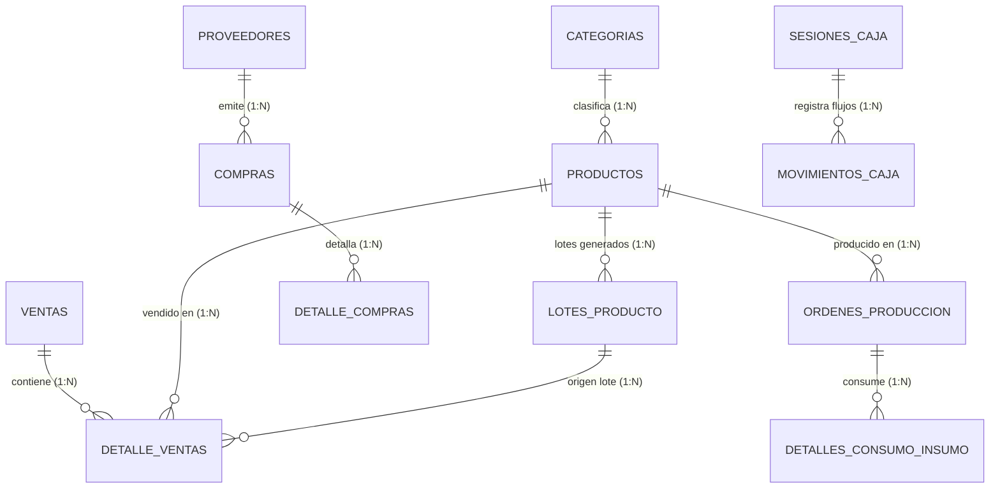

# DOCUMENTACIÓN TÉCNICA DE BASE DE DATOS ORACLE
**Sistema:** ERP Agro Peruvian Foods S.A.C.  
**Plataforma SGBD:** Oracle Database (23c Free / 21c / 19c)  
**Herramienta de Gestión:** Oracle SQL Developer  
**Fecha de Emisión:** Septiembre 2026  

---

## 1. INTRODUCCIÓN Y ALCANCE

El presente documento detalla la estructura relacional, diccionario de datos, restricciones de integridad y scripts de operación de la base de datos para el sistema **ERP Agro Peruvian Foods S.A.C.** 

El modelo soporta los cinco procesos troncales de la empresa agroindustrial:
1. **Catálogo e Inventario:** Control de líneas de productos y stock consolidado.
2. **Compras y Proveedores:** Gestión de compras de materia prima, insumos agrícolas y empaques con control de saldos y RUC.
3. **Caja Chica y Arqueos:** Aperturas de sesión, movimientos de ingresos/egresos y balance de diferencias de efectivo.
4. **Producción y Lotes (FEFO):** Órdenes de transformación, consumo de insumos y control de trazabilidad por lotes bajo regla FEFO (*First Expired, First Out*).
5. **Ventas y Despacho:** Emisión de comprobantes/tickets y deducción del inventario con asignación de lotes específicos.

---

## 2. DIAGRAMA ENTIDAD - RELACIÓN (MER)



---

## 3. DICCIONARIO DE DATOS DETALLADO

### 3.1. Módulo: Catálogo e Inventario

#### Tabla: `CATEGORIAS`
Clasificación de los productos e insumos de la empresa.

| Campo | Tipo | Nulo | Clave / Restricción | Descripción |
| :--- | :--- | :--- | :--- | :--- |
| `ID` | `NUMBER` | NO | `PK` (Identity) | Identificador correlativo de categoría. |
| `NOMBRE` | `VARCHAR2(80)` | NO | `UNIQUE` | Nombre único de la categoría. |
| `DESCRIPCION` | `VARCHAR2(200)` | SÍ | - | Detalle o alcance de la categoría. |

#### Tabla: `PRODUCTOS`
Catálogo de productos terminados e insumos principales para el ERP.

| Campo | Tipo | Nulo | Clave / Restricción | Descripción |
| :--- | :--- | :--- | :--- | :--- |
| `ID` | `NUMBER` | NO | `PK` (Identity) | Identificador secuencial del producto. |
| `NOMBRE` | `VARCHAR2(120)` | NO | - | Denominación comercial o técnica. |
| `PRECIO` | `NUMBER(10,2)` | NO | `CHECK (PRECIO > 0)` | Precio de venta en moneda nacional (PEN). |
| `STOCK` | `NUMBER(10)` | NO | `DEFAULT 0`, `CHECK (STOCK >= 0)` | Saldo físico total disponible. |
| `ID_CATEGORIA` | `NUMBER` | SÍ | `FK` $\rightarrow$ `CATEGORIAS(ID)` | Categoría a la que pertenece. |

---

### 3.2. Módulo: Compras y Proveedores

#### Tabla: `PROVEEDORES`
Maestro de proveedores agrícolas y de materiales de empaque.

| Campo | Tipo | Nulo | Clave / Restricción | Descripción |
| :--- | :--- | :--- | :--- | :--- |
| `ID` | `NUMBER` | NO | `PK` (Identity) | Código interno de proveedor. |
| `RUC` | `VARCHAR2(11)` | NO | `UNIQUE` | Número de RUC SUNAT (11 dígitos). |
| `RAZON_SOCIAL` | `VARCHAR2(150)` | NO | - | Razón social o denominación comercial. |
| `TELEFONO` | `VARCHAR2(20)` | SÍ | - | Teléfono móvil o fijo. |
| `EMAIL` | `VARCHAR2(80)` | SÍ | - | Correo electrónico comercial. |
| `DIRECCION` | `VARCHAR2(200)` | SÍ | - | Domicilio fiscal o sede. |

#### Tabla: `COMPRAS`
Cabecera del registro de compras con control tributario y de saldos.

| Campo | Tipo | Nulo | Clave / Restricción | Descripción |
| :--- | :--- | :--- | :--- | :--- |
| `ID` | `NUMBER` | NO | `PK` (Identity) | Identificador de la compra. |
| `NUMERO_COMPROBANTE` | `VARCHAR2(30)` | NO | - | Factura/boleta de proveedor. |
| `ID_PROVEEDOR` | `NUMBER` | NO | `FK` $\rightarrow$ `PROVEEDORES(ID)` | Proveedor emisor. |
| `FECHA_EMISION` | `DATE` | NO | `DEFAULT SYSDATE` | Fecha de expedición del documento. |
| `ESTADO` | `VARCHAR2(20)` | NO | `CHECK ('REGISTRADA', 'PAGADA', 'ANULADA')` | Estado administrativo-contable. |
| `SUBTOTAL` | `NUMBER(12,2)` | NO | - | Base imponible. |
| `IGV` | `NUMBER(12,2)` | NO | - | Impuesto legal (18%). |
| `TOTAL` | `NUMBER(12,2)` | NO | `CHECK (TOTAL >= 0)` | Monto final de la compra. |
| `SALDO_PENDIENTE` | `NUMBER(12,2)` | NO | `DEFAULT 0`, `CHECK (SALDO >= 0)` | Importe adeudado por pagar. |

#### Tabla: `DETALLE_COMPRAS`
Partidas e insumos detallados dentro de cada compra.

| Campo | Tipo | Nulo | Clave / Restricción | Descripción |
| :--- | :--- | :--- | :--- | :--- |
| `ID` | `NUMBER` | NO | `PK` (Identity) | Identificador de línea. |
| `ID_COMPRA` | `NUMBER` | NO | `FK` $\rightarrow$ `COMPRAS(ID) ON DELETE CASCADE` | Enlace a la cabecera. |
| `ID_INSUMO` | `NUMBER` | NO | - | Identificador del producto/insumo. |
| `NOMBRE_INSUMO` | `VARCHAR2(120)` | NO | - | Descripción textual del ítem. |
| `CANTIDAD` | `NUMBER(12,3)` | NO | `CHECK (CANTIDAD > 0)` | Cantidad física comprada. |
| `PRECIO_UNITARIO` | `NUMBER(10,2)` | NO | `CHECK (PRECIO_UNITARIO > 0)` | Costo unitario neto. |
| `SUBTOTAL` | `NUMBER(12,2)` | NO | - | Importe total de la partida. |

---

### 3.3. Módulo: Caja Chica y Arqueos

#### Tabla: `SESIONES_CAJA`
Turnos diarios y control de arqueo de cajeros.

| Campo | Tipo | Nulo | Clave / Restricción | Descripción |
| :--- | :--- | :--- | :--- | :--- |
| `ID` | `NUMBER` | NO | `PK` (Identity) | Identificador de la sesión. |
| `CAJERO_NOMBRE` | `VARCHAR2(100)` | NO | - | Nombre del usuario responsable. |
| `FECHA_APERTURA` | `TIMESTAMP` | NO | `DEFAULT CURRENT_TIMESTAMP` | Inicio del turno. |
| `FECHA_CIERRE` | `TIMESTAMP` | SÍ | - | Fin del turno. |
| `MONTO_APERTURA` | `NUMBER(12,2)` | NO | `CHECK (MONTO_APERTURA >= 0)` | Fondo inicial en mostrador. |
| `MONTO_CIERRE` | `NUMBER(12,2)` | SÍ | - | Efectivo físico contado en arqueo. |
| `SALDO_TEORICO` | `NUMBER(12,2)` | NO | - | Cálculo: Apertura + Entradas - Salidas. |
| `SALDO_REAL` | `NUMBER(12,2)` | SÍ | - | Monto físico real al cerrar. |
| `DIFERENCIA` | `NUMBER(12,2)` | SÍ | - | Descuadre (Sobrante/Faltante). |
| `ESTADO` | `VARCHAR2(20)` | NO | `CHECK ('ABIERTA', 'CERRADA')` | Estado operativo del turno. |
| `OBSERVACIONES` | `VARCHAR2(300)` | SÍ | - | Justificaciones del arqueo. |

#### Tabla: `MOVIMIENTOS_CAJA`
Registro individual de ingresos o egresos de dinero.

| Campo | Tipo | Nulo | Clave / Restricción | Descripción |
| :--- | :--- | :--- | :--- | :--- |
| `ID` | `NUMBER` | NO | `PK` (Identity) | ID de movimiento. |
| `ID_SESION_CAJA` | `NUMBER` | NO | `FK` $\rightarrow$ `SESIONES_CAJA(ID)` | Sesión activa vinculada. |
| `TIPO` | `VARCHAR2(20)` | NO | `CHECK ('INGRESO', 'EGRESO')` | Flujo de efectivo. |
| `MONTO` | `NUMBER(12,2)` | NO | `CHECK (MONTO > 0)` | Importe de la transacción. |
| `CONCEPTO` | `VARCHAR2(200)` | NO | - | Glosa explicativa de la transacción. |
| `METODO_PAGO` | `VARCHAR2(30)` | NO | `CHECK IN ('EFECTIVO','YAPE','PLIN','TRANSFERENCIA')` | Canal monetario. |
| `REFERENCIA` | `VARCHAR2(100)` | SÍ | - | Código de operación o ticket. |
| `FECHA` | `TIMESTAMP` | NO | `DEFAULT CURRENT_TIMESTAMP` | Momento del movimiento. |

---

### 3.4. Módulo: Producción y Control FEFO

#### Tabla: `ORDENES_PRODUCCION`
Programación de producción y lotización de bienes transformados.

| Campo | Tipo | Nulo | Clave / Restricción | Descripción |
| :--- | :--- | :--- | :--- | :--- |
| `ID` | `NUMBER` | NO | `PK` (Identity) | ID interno de orden. |
| `CODIGO_ORDEN` | `VARCHAR2(30)` | NO | `UNIQUE` | Código visible (ej. `OP-20260910-001`). |
| `ID_PRODUCTO` | `NUMBER` | NO | `FK` $\rightarrow$ `PRODUCTOS(ID)` | Producto final terminado. |
| `NOMBRE_PRODUCTO` | `VARCHAR2(120)` | NO | - | Descripción del producto final. |
| `CANTIDAD_PROGRAMADA` | `NUMBER(10)` | NO | `CHECK (CANTIDAD_PROGRAMADA > 0)` | Meta de unidades requeridas. |
| `CANTIDAD_PRODUCIDA` | `NUMBER(10)` | SÍ | - | Unidades efectivamente aprobadas. |
| `FECHA_INICIO` | `TIMESTAMP` | NO | `DEFAULT CURRENT_TIMESTAMP` | Inicio del proceso. |
| `FECHA_FIN` | `TIMESTAMP` | SÍ | - | Término del proceso. |
| `ESTADO` | `VARCHAR2(20)` | NO | `CHECK IN ('PLANIFICADA','EN_PROCESO','COMPLETADA','CANCELADA')` | Estado de la orden. |
| `OBSERVACIONES` | `VARCHAR2(300)` | SÍ | - | Notas de calidad o mermas. |

#### Tabla: `DETALLES_CONSUMO_INSUMO`
Insumos y envases aplicados a cada orden de producción.

| Campo | Tipo | Nulo | Clave / Restricción | Descripción |
| :--- | :--- | :--- | :--- | :--- |
| `ID` | `NUMBER` | NO | `PK` (Identity) | Identificador de detalle. |
| `ID_ORDEN_PRODUCCION` | `NUMBER` | NO | `FK` $\rightarrow$ `ORDENES_PRODUCCION(ID) ON DELETE CASCADE` | Orden matriz. |
| `ID_INSUMO` | `NUMBER` | NO | - | Identificador del insumo gastado. |
| `NOMBRE_INSUMO` | `VARCHAR2(120)` | NO | - | Nombre descriptivo del insumo. |
| `CANTIDAD_REQUERIDA` | `NUMBER(12,3)` | NO | `CHECK (CANTIDAD_REQUERIDA > 0)` | Cantidad teórica según receta. |
| `CANTIDAD_CONSUMIDA` | `NUMBER(12,3)` | NO | `DEFAULT 0` | Cantidad física real usada. |
| `UNIDAD_MEDIDA` | `VARCHAR2(20)` | NO | - | Unidad (ej. 'UNIDADES', 'KG', 'L'). |

#### Tabla: `LOTES_PRODUCTO`
Control de lotes con fechas de caducidad para despacho por criterio **FEFO**.

| Campo | Tipo | Nulo | Clave / Restricción | Descripción |
| :--- | :--- | :--- | :--- | :--- |
| `ID` | `NUMBER` | NO | `PK` (Identity) | Identificador de lote. |
| `CODIGO_LOTE` | `VARCHAR2(30)` | NO | `UNIQUE` | Código de trazabilidad de lote. |
| `ID_PRODUCTO` | `NUMBER` | NO | `FK` $\rightarrow$ `PRODUCTOS(ID)` | Producto al que pertenece el lote. |
| `NOMBRE_PRODUCTO` | `VARCHAR2(120)` | NO | - | Nombre descriptivo del producto. |
| `STOCK_DISPONIBLE` | `NUMBER(10)` | NO | `CHECK (STOCK_DISPONIBLE >= 0)` | Saldo físico del lote. |
| `FECHA_PRODUCCION` | `DATE` | NO | - | Fecha de fabricación/envasado. |
| `FECHA_VENCIMIENTO` | `DATE` | NO | `CHECK (VENCIMIENTO >= PRODUCCION)` | Fecha de expiración sanitaria. |

*Índice Optimizado:*
```sql
CREATE INDEX IDX_LOTE_FEFO ON LOTES_PRODUCTO(ID_PRODUCTO, FECHA_VENCIMIENTO ASC);
```

---

### 3.5. Módulo: Ventas y Despacho

#### Tabla: `VENTAS`
Cabecera de tickets y boletas de venta al cliente.

| Campo | Tipo | Nulo | Clave / Restricción | Descripción |
| :--- | :--- | :--- | :--- | :--- |
| `ID` | `NUMBER` | NO | `PK` (Identity) | Identificador único de venta. |
| `NUMERO_TICKET` | `VARCHAR2(30)` | NO | `UNIQUE` | Serie y correlativo (ej. `TKT-20260913-001`). |
| `FECHA` | `TIMESTAMP` | NO | `DEFAULT CURRENT_TIMESTAMP` | Momento exacto de la venta. |
| `ESTADO` | `VARCHAR2(20)` | NO | `CHECK ('REGISTRADA', 'ANULADA')` | Estado del documento. |
| `METODO_PAGO` | `VARCHAR2(30)` | NO | `CHECK IN ('EFECTIVO','YAPE','PLIN','TRANSFERENCIA')` | Forma de cobro. |
| `SUBTOTAL` | `NUMBER(12,2)` | NO | - | Base imponible neta. |
| `IGV` | `NUMBER(12,2)` | NO | - | 18% impuesto fiscal. |
| `TOTAL` | `NUMBER(12,2)` | NO | `CHECK (TOTAL >= 0)` | Monto final cobrado. |
| `CLIENTE_NOMBRE` | `VARCHAR2(120)` | SÍ | - | Razón social o nombre de cliente. |

#### Tabla: `DETALLE_VENTAS`
Partidas de venta asociadas al lote específico de donde se rebajó el stock.

| Campo | Tipo | Nulo | Clave / Restricción | Descripción |
| :--- | :--- | :--- | :--- | :--- |
| `ID` | `NUMBER` | NO | `PK` (Identity) | Identificador de ítem de venta. |
| `ID_VENTA` | `NUMBER` | NO | `FK` $\rightarrow$ `VENTAS(ID) ON DELETE CASCADE` | Enlace a la cabecera. |
| `ID_PRODUCTO` | `NUMBER` | NO | `FK` $\rightarrow$ `PRODUCTOS(ID)` | Producto expedido. |
| `ID_LOTE` | `NUMBER` | SÍ | `FK` $\rightarrow$ `LOTES_PRODUCTO(ID)` | Lote específico descontado (FEFO). |
| `NOMBRE_PRODUCTO` | `VARCHAR2(120)` | NO | - | Nombre al momento de la venta. |
| `PRECIO_UNITARIO` | `NUMBER(10,2)` | NO | `CHECK (PRECIO_UNITARIO > 0)` | Precio cobrado por unidad. |
| `CANTIDAD` | `NUMBER(10)` | NO | `CHECK (CANTIDAD > 0)` | Cantidad de unidades vendidas. |
| `SUBTOTAL` | `NUMBER(12,2)` | NO | - | Importe de la línea. |

---

## 4. GUÍA DE INSTALACIÓN EN ORACLE SQL DEVELOPER

1. Abrir **Oracle SQL Developer**.
2. Conectarse al usuario de base de datos (`BOMERP_APP`).
3. Abrir una nueva **Hoja de Trabajo SQL (SQL Worksheet)**.
4. Si se requiere limpiar tablas previas, ejecutar en bloque:
   ```sql
   DROP TABLE DETALLE_VENTAS CASCADE CONSTRAINTS;
   DROP TABLE VENTAS CASCADE CONSTRAINTS;
   DROP TABLE LOTES_PRODUCTO CASCADE CONSTRAINTS;
   DROP TABLE DETALLES_CONSUMO_INSUMO CASCADE CONSTRAINTS;
   DROP TABLE ORDENES_PRODUCCION CASCADE CONSTRAINTS;
   DROP TABLE MOVIMIENTOS_CAJA CASCADE CONSTRAINTS;
   DROP TABLE SESIONES_CAJA CASCADE CONSTRAINTS;
   DROP TABLE DETALLE_COMPRAS CASCADE CONSTRAINTS;
   DROP TABLE COMPRAS CASCADE CONSTRAINTS;
   DROP TABLE PROVEEDORES CASCADE CONSTRAINTS;
   DROP TABLE PRODUCTOS CASCADE CONSTRAINTS;
   DROP TABLE CATEGORIAS CASCADE CONSTRAINTS;
   ```
5. Ejecutar la creación de tablas DDL y la inserción de datos semilla.
6. Ejecutar siempre la sentencia `COMMIT;` al final para asentar las transacciones en Oracle.

---

## 5. CONSULTAS ESTRATÉGICAS DE NEGOCIO

### 5.1. Despacho FEFO (Identificación del lote a despachar primero)
```sql
SELECT 
    p.ID AS COD_PROD,
    p.NOMBRE AS PRODUCTO,
    l.CODIGO_LOTE,
    l.STOCK_DISPONIBLE,
    l.FECHA_VENCIMIENTO,
    TRUNC(l.FECHA_VENCIMIENTO - SYSDATE) AS DIAS_HASTA_VENCIMIENTO
FROM PRODUCTOS p
JOIN LOTES_PRODUCTO l ON p.ID = l.ID_PRODUCTO
WHERE l.STOCK_DISPONIBLE > 0
ORDER BY p.ID, l.FECHA_VENCIMIENTO ASC;
```

### 5.2. Reporte de Rendimiento y Desviación de Producción
```sql
SELECT 
    CODIGO_ORDEN,
    NOMBRE_PRODUCTO,
    CANTIDAD_PROGRAMADA,
    CANTIDAD_PRODUCIDA,
    (CANTIDAD_PRODUCIDA - CANTIDAD_PROGRAMADA) AS DIFERENCIA_UNIDADES,
    ROUND((CANTIDAD_PRODUCIDA / CANTIDAD_PROGRAMADA) * 100, 2) AS PORCENTAJE_CUMPLIMIENTO,
    ESTADO
FROM ORDENES_PRODUCCION
WHERE ESTADO = 'COMPLETADA';
```

### 5.3. Arqueo y Control de Descuadre en Cajas
```sql
SELECT 
    ID,
    CAJERO_NOMBRE,
    FECHA_APERTURA,
    MONTO_APERTURA,
    SALDO_TEORICO,
    SALDO_REAL,
    DIFERENCIA,
    CASE 
        WHEN DIFERENCIA = 0 THEN 'CUADRE EXACTO'
        WHEN DIFERENCIA > 0 THEN 'SOBRANTE'
        WHEN DIFERENCIA < 0 THEN 'FALTANTE'
        ELSE 'EN CURSO'
    END AS EVALUACION_ARQUEO
FROM SESIONES_CAJA
ORDER BY ID DESC;
```
