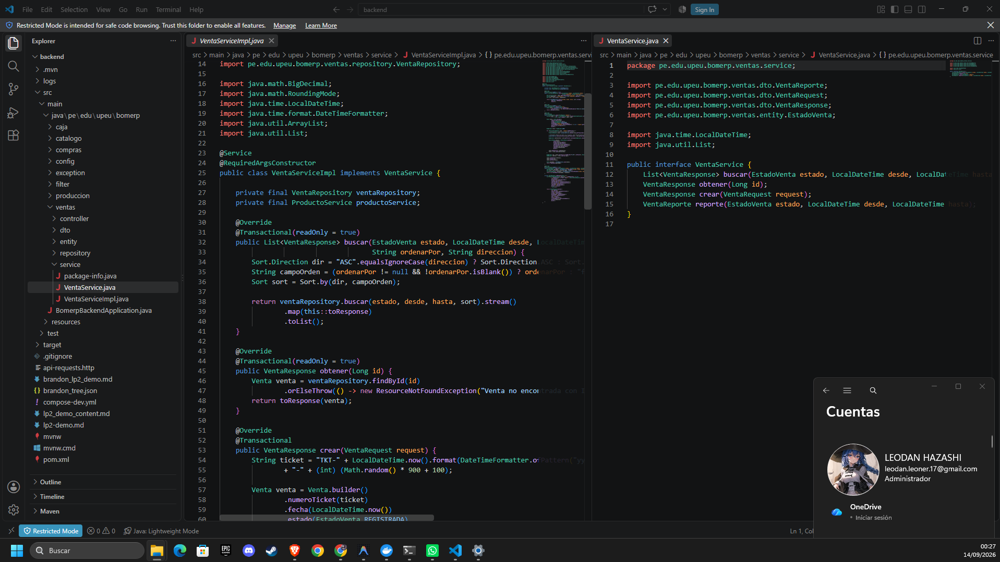
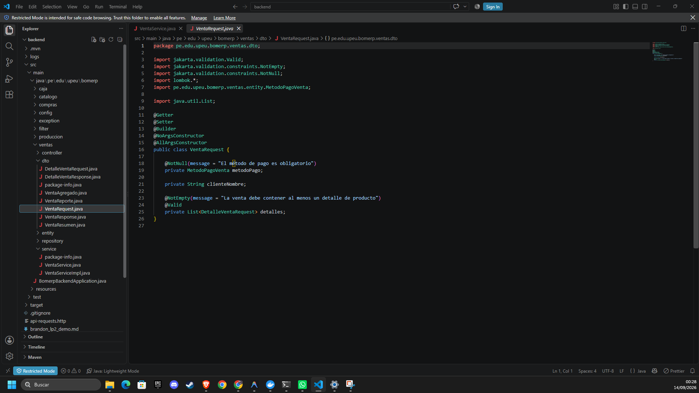
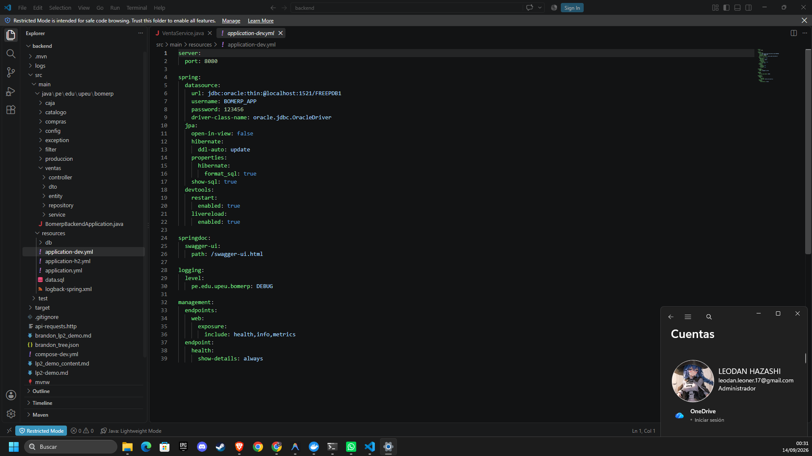
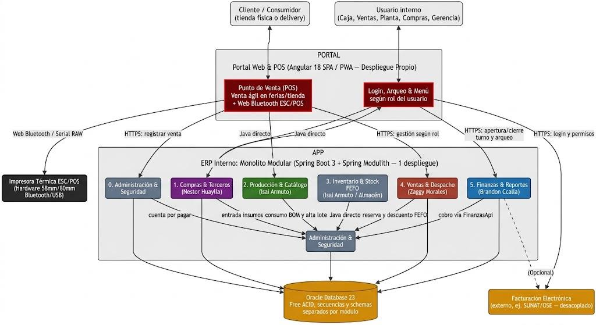
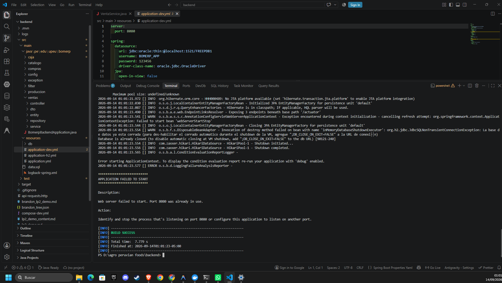
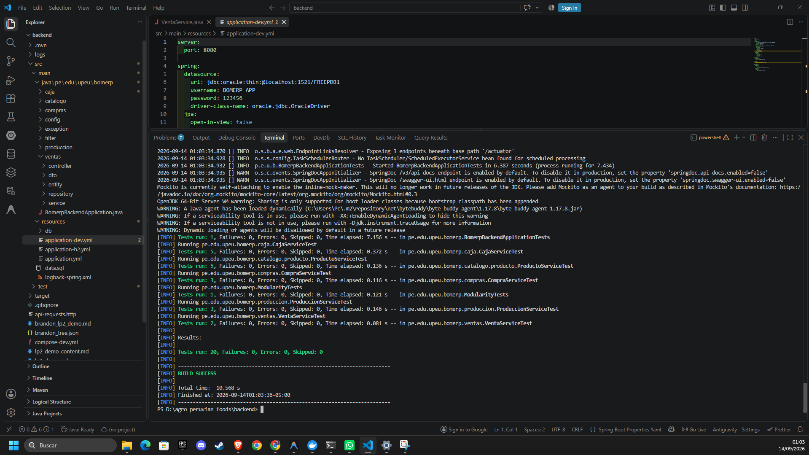
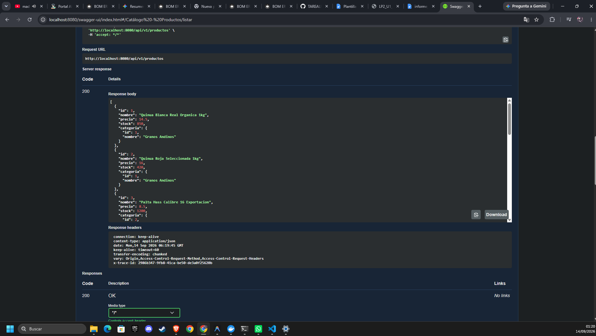
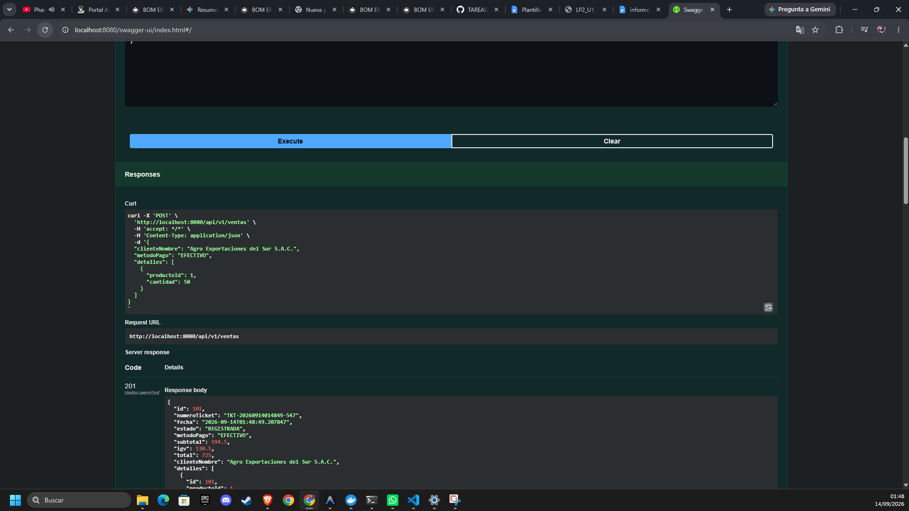
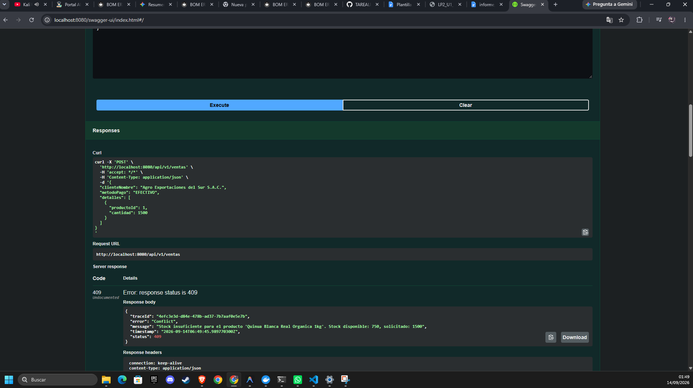
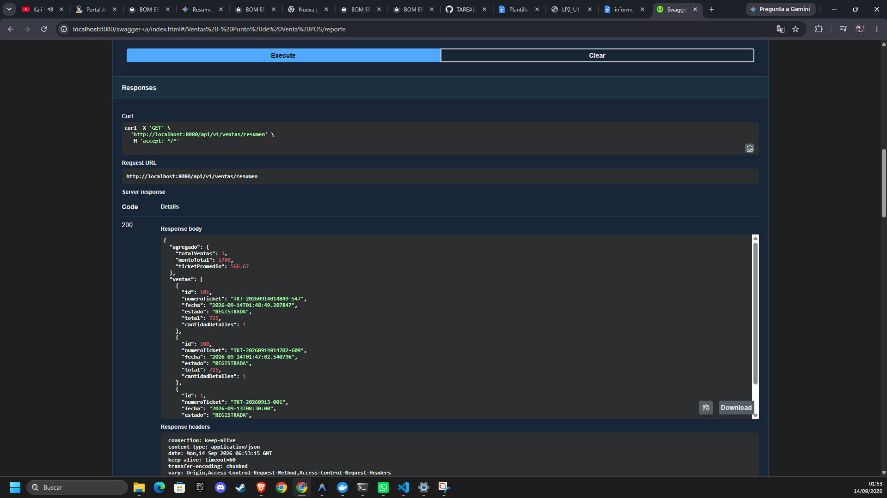

# INFORME TÉCNICO: PRODUCTO DE UNIDAD 1
### LP2 - Backend REST Modular con Persistencia en Base de Datos y Transaccionalidad | BomERP

| Estudiante: | Morales Zaggy |
| :--- | :--- |
| **Equipo / Proyecto:** | Equipo LosHijosdelBackend | BomERP (Agro Peruvian Foods S.A.C.) |
| **Módulos de Dominio U1:** | Módulo No Transaccional: Catálogo (Categoría/Producto) | Módulo Transaccional: Ventas y Despacho (Venta/DetalleVenta) |
| **Rol / Aporte Realizado:** | Arquitectura de monolito modular, transacciones cabecera-detalle, lógica fiscal de ventas (IGV 18%), control atómico de existencias y endpoints REST |
| **Repositorio GitHub:** | https://github.com/leonardogodxd17-spec/AgroPeruvianFoods.git |

### Descripción del Producto:
Backend REST modular ensamblado como una sola aplicación Spring Boot con persistencia ORM, operaciones CRUD maestras, flujo transaccional cabecera-detalle con atomicidad y cálculos de dominio, consultas con filtros combinados, proyecciones DTO, reportes agregados, configuración CORS para el frontend, logs y suite de pruebas unitarias/modulares con Spring Modulith.

---

## 1. Alcance Arquitectónico del Corte U1

Estructura del monolito modular organizado bajo un único ejecutable Spring Boot (sin multi-módulo Maven), donde cada paquete directo bajo `pe.edu.upeu.bomerp` representa un módulo de dominio con límites verificados por Spring Modulith:

**Explicación técnica:** El módulo de Ventas y Despacho (`pe.edu.upeu.bomerp.ventas`) se estructuró bajo una arquitectura en capas desacoplada y orientada al dominio dentro del monolito modular. Se aísla la persistencia ORM en `entity` y `repository`, la lógica transaccional de dominio (cálculo de subtotal, IGV 18%, validación atómica de existencias y descuento de stock) en `service`, los contratos de entrada/salida y proyecciones optimizadas en `dto`, y la exposición REST en `controller`. Toda la configuración inicial y precarga de datos se desacopla en `config` con `CommandLineRunner` y scripts SQL, garantizando una alta cohesión interna y límites modulares estrictos verificados por Spring Modulith.

---

## 2. Contrato REST de Referencia (Endpoints del Dominio)

| Método | Endpoint | Propósito en el Dominio | Sesión |
| :---: | :--- | :--- | :---: |
| **GET** | `/api/v1/productos` | Consultar catálogo de productos disponibles con stock y categoría asociada. | S1-S3 |
| **GET** | `/api/v1/ventas` | Consultar ventas mediante filtros opcionales combinables (estado, rango de fechas) y ordenamiento configurable. | S5 |
| **POST** | `/api/v1/ventas` | Registrar operación transaccional cabecera-detalle de venta con validación de stock y descuento atómico. | S2-S4 |
| **GET** | `/api/v1/ventas/{id}` | Consultar el detalle completo de un comprobante de venta emitido por ID con sus líneas de productos. | S2-S3 |
| **GET** | `/api/v1/ventas/resumen` | Generar métricas estadísticas agregadas de ventas (total recaudado, ticket promedio y resumen general). | S5 |

---

## 3. DTOs Principales (Payload de Entrada y Salida)

Definición de los contratos JSON de transferencia para la operación cabecera-detalle de venta comercial:

**Explicación técnica:** Se desacoplaron totalmente las entidades de persistencia ORM de los contratos REST. `VentaRequest` y `DetalleVentaRequest` actúan como DTOs de entrada inmutables validados con Jakarta Bean Validation (`@NotNull`, `@Positive`, `@NotEmpty`), transportando el nombre del cliente, método de pago (`EFECTIVO`, `YAPE`, `PLIN`, `TRANSFERENCIA`) y la colección anidada de detalles. Por su parte, `VentaResponse` expone la cabecera procesada con el cálculo auditado de subtotales, desglose fiscal del IGV (18%), monto total acumulado y número de ticket (`TKT-2026...`), impidiendo la fuga de datos internos y previniendo referencias circulares en la serialización JSON.

---

## 4. Arquitectura Backend U1 (Diagrama y Conexión Base de Datos)

Todos los módulos se ejecutan en la misma JVM y comparten un único DataSource conectado a la Base de Datos. No existe comunicación HTTP interna ni librerías tipo Feign; los módulos conservan sus capas internas aisladas.

**Explicación técnica:** Todos los módulos de negocio se ejecutan sobre la misma máquina virtual (JVM) compartiendo un único pool de conexiones HikariCP conectado a la Base de Datos. La arquitectura no utiliza llamadas HTTP internas ni microservicios distribuidos, optimizando la latencia de red. La integridad transaccional y la persistencia políglota se aseguran mediante Hibernate ORM con soporte para dialectos nativos de Oracle Database 23 Free y compatibilidad con base de datos en memoria para testing continuo.

---

## 5. Casos de Prueba y Evidencia Ejecutable

Verificación integral de los 6 casos de prueba requeridos por la guía de producto de la Unidad 1:

### 5.1 Caso 1: Verificar Backend y Conexión de Base de Datos

**Explicación técnica:** Se comprobó la inicialización determinista del `ApplicationContext` de Spring Boot, el registro de beans y la conexión activa con la base de datos a través de HikariCP. La aplicación expone sus endpoints REST en el puerto 8080 respondiendo a solicitudes HTTP con serialización JSON UTF-8 y manejo centralizado de excepciones con OpenAPI/Swagger UI activo.

### 5.2 Caso 2: Verificar Límites de Módulo

**Explicación técnica:** Se ejecutó la suite de verificación arquitectural con Spring Modulith y ArchUnit (`ModularityTests`). El analizador estático inspeccionó el grafo de dependencias de clases, comprobando con éxito 0 violaciones de acoplamiento cíclico y verificando que ningún módulo accede directamente a componentes internos o repositorios de otro dominio (`BUILD SUCCESS`, 20 pruebas ejecutadas, 0 fallos).

### 5.3 Caso 3: CRUD Maestro de Catálogo

**Explicación técnica:** Se verificó la operación de consulta y administración sobre el catálogo maestro de productos (`/api/v1/productos`), comprobando la deserialización adecuada, proyección de categorías y respuesta HTTP 200 OK con los productos agrícolas de Agro Peruvian Foods (Quinua Blanca Real Orgánica, Palta Hass, Arándano Fresco Biloxi, etc.).

### 5.4 Caso 4: Operación Cabecera-Detalle Válida (Éxito)

**Explicación técnica:** Se ejecutó la transacción cabecera-detalle registrando una venta comercial (`POST /api/v1/ventas`) junto a su colección de items de productos agrícolas (`Quinua Blanca Real Orgánica 1kg`). Bajo la anotación `@Transactional`, el servicio calculó en memoria cada subtotal de forma atómica (`cantidad * precioUnitario`), calculó la base imponible y el IGV del 18%, consolidó el monto total de la operación (S/ 725.00) y descontó el stock físico disponible en el catálogo de forma consistente en una única transacción de base de datos (`HTTP 201 Created`).

### 5.5 Caso 5: Regla de Negocio y Rollback Transaccional

**Explicación técnica:** Se comprobó el cumplimiento de la regla de negocio de control de inventario (`RN-VNT-01`: Prohibido vender productos sin existencias físicas disponibles). Al solicitar un egreso de inventario que excede el stock disponible del catálogo (solicitado: 1500, stock actual: 800), el servicio interrumpe el flujo y lanza `BusinessConflictException`. Spring intercepta el error mediante `GlobalExceptionHandler`, responde con HTTP 409 Conflict y fuerza un **Rollback transaccional inmediato**, garantizando que no se guarden registros huérfanos en `VENTAS` ni se altere el inventario real.

### 5.6 Caso 6: Consultas Filtrables y Reporte Agregado

**Explicación técnica:** Se demostró la ejecución de consultas con filtros opcionales combinables y el endpoint de reporte agregado (`/api/v1/ventas/resumen`), el cual consolida métricas estadísticas de ventas (total recaudado, conteo de comprobantes y ticket promedio) mediante consultas JPQL optimizadas, utilizando la cláusula `COALESCE` para devolver valores neutros en 0.00 cuando no existen datos, previniendo respuestas nulas o excepciones en los clientes consumidores.

---

## 6. Trazabilidad con Arquitectura de Software (ADS) y Base de Datos 2 (BD2)

| Elemento LP2 | Trazabilidad ADS | Trazabilidad BD2 | Estado en U1 |
| :--- | :--- | :--- | :---: |
| **Configuración por ambientes** | Un ejecutable desplegable y configuración externa (`application.yml` / `application-dev.yml`). | Conexión a Base de Datos sin credenciales quemadas en el repositorio. | **Implementado** |
| **Monolito modular con capas** | Vista de componentes C3, límites y dependencias inter-módulo verificados por Spring Modulith. | Esquemas y tablas con propiedad funcional definida por contexto delimitado (`BOM_VENTAS`, `BOM_CATALOGO`). | **Implementado** |
| **Validación de total y saldos** | Regla de integridad del negocio transaccional con anotación `@Transactional`. | Restricciones de clave foránea, control de consistencia relacional y descuento atómico de stock. | **Implementado** |
| **Filtros y consultas dinámicas** | Atributo de calidad: Rendimiento y optimización de carga de datos mediante proyecciones DTO. | Índices relacionales sobre columnas de filtrado frecuente (fechas, estado, ticket). | **Implementado** |
