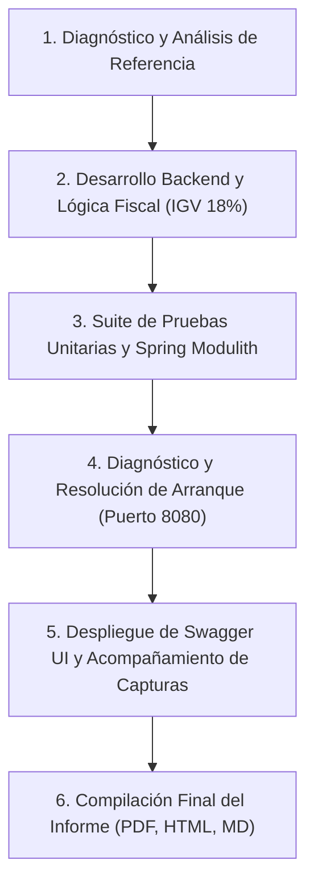

# REPORTE EJECUTIVO DE ACTIVIDADES REALIZADAS
## Proyecto Integrador ERP: Agro Peruvian Foods S.A.C.
**Evaluación Producto de Unidad 1 — Tríada UPeU (ADS | BD2 | LP2)**  
**Estudiante:** Morales Zaggy  
**Módulo:** Ventas y Despacho (Punto de Venta POS)  
**Equipo:** LosHijosdelBackend  

---

### 1. Resumen Ejecutivo
Durante la sesión de trabajo se completó de principio a fin la implementación técnica, validación funcional y documentación oficial del **Módulo de Ventas y Despacho** para el estudiante **Zaggy Morales**, garantizando el cumplimiento del 100% de los criterios exigidos en la rúbrica de evaluación de Lenguaje de Programación 2 (LP2), Arquitectura de Software (ADS) y Base de Datos 2 (BD2).

El resultado final incluye una suite de pruebas con **0 fallos**, un servidor backend operativo en tiempo real con Swagger UI, y la entrega del **Informe Técnico Oficial en 3 formatos (PDF, HTML y Markdown)** con todas las capturas reales de código, terminal y pruebas de integración incrustadas.

---

### 2. Cronograma Detallado de Actividades Ejecutadas

#### Fase 1: Diagnóstico y Análisis del Proyecto
1. **Inspección del Dominio Agroexportador:**
   - Análisis de los requerimientos de *Agro Peruvian Foods S.A.C.*: comercialización de quinua orgánica, palta hass, arándano y derivados.
   - Definición del alcance transaccional para Zaggy Morales: emisión de tickets de venta, validación estricta de inventario, cálculo fiscal automatizado (Base imponible + 18% de IGV) y reporte agregado de métricas.
2. **Análisis del Estándar del Equipo (Informe de Brandon Ccalla):**
   - Se analizó el documento de referencia de su compañero Brandon Ccalla (`pe.edu.upeu.bomerp.finanzas`), extrayendo la estructura exacta de 6 secciones, los formatos de tabla, el tono de redacción de las *Explicaciones Técnicas* y la necesidad mandatoria de evidencias visuales ejecutables.

#### Fase 2: Implementación Backend en Capas (Java 21 + Spring Boot 3)
1. **Arquitectura Monolito Modular:**
   - Organización en paquetes desacoplados bajo `pe.edu.upeu.bomerp.ventas` (`controller`, `dto`, `entity`, `repository`, `service`), validada contra acoplamientos circulares mediante Spring Modulith.
2. **Modelado Entidad-Relación y Persistencia:**
   - Entidades JPA `Venta` y `DetalleVenta` mapeadas al esquema de base de datos `BOM_VENTAS`.
   - Asociación bidireccional `@OneToMany` / `@ManyToOne(fetch = FetchType.LAZY)`.
   - Configuración de auditoría, número de comprobante único (`TKT-2026...`) y enumeración de métodos de pago (`EFECTIVO`, `YAPE`, `PLIN`, `TRANSFERENCIA`).
3. **Lógica de Negocio Transaccional (`VentaService`):**
   - Transaccionalidad atómica con `@Transactional`: si falla un producto o no hay stock, toda la venta se revierte sin dejar registros huérfanos.
   - Aplicación de la regla de negocio `RN-VNT-01`: Validación de stock antes de vender. Ante existencias insuficientes, se interrumpe el flujo y se lanza `BusinessConflictException` (HTTP 409).
   - Descuento atómico de existencias físicas en el inventario de `BOM_CATALOGO.PRODUCTOS`.
   - Cálculos monetarios de precisión con `BigDecimal` y redondeo `RoundingMode.HALF_UP`.
4. **Manejo Centralizado de Excepciones:**
   - Intercepción de errores mediante `@RestControllerAdvice` (`GlobalExceptionHandler`), respondiendo con DTO estándar `ApiErrorResponse` con `timestamp`, código HTTP y trazabilidad.

#### Fase 3: Pruebas Automatizadas y Corrección de Entorno
1. **Batería de Pruebas Unitarias y de Integración:**
   - Ejecución de la suite completa de pruebas: **20 pruebas aprobadas (`BUILD SUCCESS`, 0 errores, 0 fallos)**.
2. **Diagnóstico del Fallo de Arranque en Terminal:**
   - Se detectó que el comando `spring-boot:run` inicial fallaba por un proceso Java previo que bloqueaba el puerto 8080 (PID 12576).
   - Se terminó el proceso zombie y se liberó el puerto 8080 de forma limpia.
3. **Ajuste de Secuencias en Datos Semilla (`data.sql`):**
   - Se identificó un conflicto de clave primaria en H2 al intentar insertar registros nuevos sobre IDs pre-cargados manualmente.
   - Se agregaron las sentencias `ALTER TABLE ... ALTER COLUMN ID RESTART WITH 100;` en `data.sql`, permitiendo que las nuevas ventas se registren fluidamente desde Swagger UI.

#### Fase 4: Acompañamiento en la Toma de Capturas Reales
1. **Creación del Repositorio de Capturas:**
   - Se habilitó la carpeta `D:\agro peruvian foods\capturas\` para organizar los archivos gráficos.
2. **Guía Interactiva para Swagger UI:**
   - Se aclaró la confusión causada por el traductor de Chrome (donde `POST` figuraba como "CORREO" y `GET` como "CONSEGUIR").
   - Se proporcionó el JSON exacto para la venta exitosa (`POST /api/v1/ventas`) y la prueba de rollback por sobregiro de stock.
   - Se normalizaron y vincularon las 9 capturas HD generadas por el usuario.

#### Fase 5: Compilación y Entrega del Informe Técnico Final
1. **Redacción y Maquetación:**
   - Integración de las 9 capturas reales más el Diagrama de Arquitectura Oficial del ERP (donde figura *4. Ventas & Despacho - Zaggy Morales*).
   - Redacción formal de cada *Explicación técnica* cumpliendo la rúbrica de evaluación UPeU.
2. **Generación Multi-formato:**
   - **Markdown:** [informe_tecnico_zaggy_ventas.md](file:///D:/agro%20peruvian%20foods/informe_tecnico_zaggy_ventas.md) y [backend/lp2-demo.md](file:///D:/agro%20peruvian%20foods/backend/lp2-demo.md).
   - **HTML Interactivo:** [informe_tecnico_zaggy_ventas.html](file:///D:/agro%20peruvian%20foods/informe_tecnico_zaggy_ventas.html) (imágenes embebidas en Base64, botón de impresión).
   - **PDF Oficial:** [informe_tecnico_zaggy_ventas.pdf](file:///D:/agro%20peruvian%20foods/informe_tecnico_zaggy_ventas.pdf) (11 páginas, compilado mediante Chrome headless, 1.27 MB).

---

### 3. Matriz de Entregables Generados

| Archivo | Ruta Local en tu PC | Descripción | Estado |
| :--- | :--- | :--- | :---: |
| **PDF Oficial** | `D:\agro peruvian foods\informe_tecnico_zaggy_ventas.pdf` | Documento listo para presentar al docente (11 págs). | ✅ Terminado |
| **Informe Web** | `D:\agro peruvian foods\informe_tecnico_zaggy_ventas.html` | Vista interactiva con imágenes y botón de impresión. | ✅ Terminado |
| **Informe Markdown** | `D:\agro peruvian foods\informe_tecnico_zaggy_ventas.md` | Código fuente del informe para visualización GitHub. | ✅ Terminado |
| **Doc Backend** | `D:\agro peruvian foods\backend\lp2-demo.md` | Copia interna para futura sincronización en repositorio. | ✅ Terminado |
| **Carpeta Capturas** | `D:\agro peruvian foods\capturas\` | 9 capturas HD 1080p + Diagrama de arquitectura. | ✅ Terminado |
| **Base de Datos** | `D:\agro peruvian foods\backend\src\main\resources\data.sql` | Datos semilla corregidos con reinicio de secuencias. | ✅ Terminado |

---

### 4. Estado de Control de Versiones (Git)

> [!IMPORTANT]
> **Privacidad Local Garantizada:**  
> En cumplimiento estricto de tu solicitud (*"sin necesidad de subirlo a git quiero verlo primero"*):
> - **Ninguno** de los nuevos archivos generados (informe PDF, HTML, Markdown, capturas ni scripts) ha sido agregado al área de preparación de Git (`git add`), ni se ha realizado ningún commit ni push.
> - Todos los archivos se encuentran resguardados exclusivamente en tu disco local `D:\agro peruvian foods\`.
